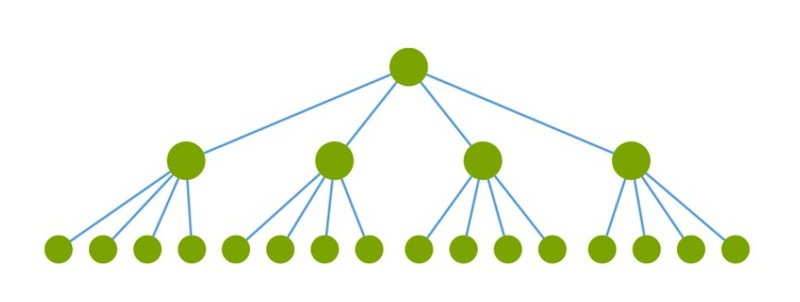
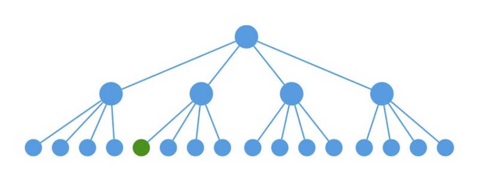
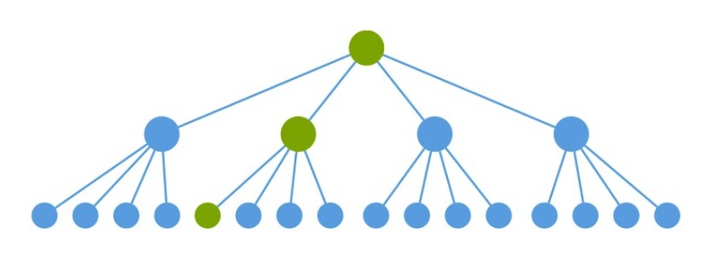
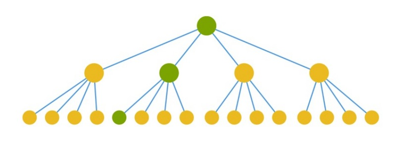
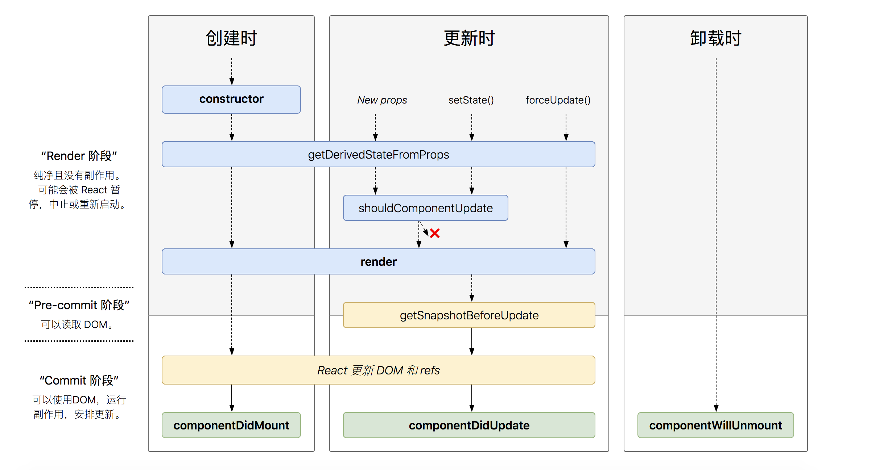

## react 性能优化一些事

### render

假设如下节点发生变化，理想状态







但是react的默认做法是调用所有组件的render，再对生成的虚拟DOM进行对比，如不变则不进行更新。这样的render和虚拟DOM的对比明显是在浪费，如下图（黄色表示浪费的render和虚拟DOM对比）




### lifecycle

react 16 之前的生命周期


react 16.4 之后的生命周期




### shouldComponentUpdate


为了进一步说明问题，我们再引用一张官网的图来解释，如下图（ SCU表示shouldComponentUpdate，绿色表示返回true(需要更新)，红色表示返回false(不需要更新)；vDOMEq表示虚拟DOM比对，绿色表示一致(不需要更新)，红色表示发生改变(需要更新)）


```js
shouldComponentUpdate(nextProps, nextState) {
  return true;
}
```


### PureComponent

浅比较


### demo


### immutable 闪亮登场

 