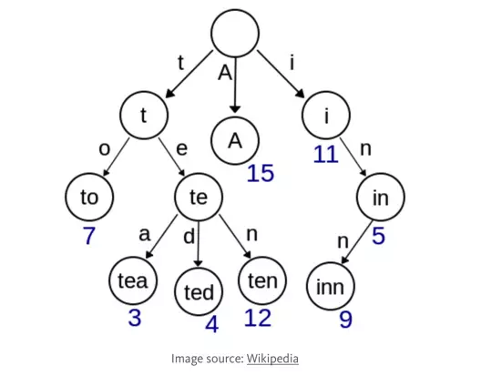
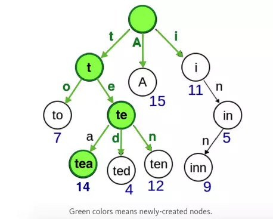
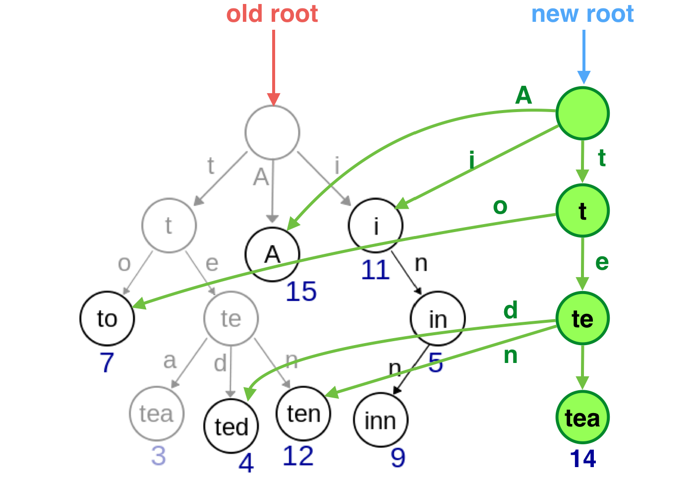

## react 性能优化之Immutable

### render

假设如下节点发生变化，理想状态




但是react的默认做法是调用所有组件的render，再对生成的虚拟DOM进行对比，如不变则不进行更新。这样的render和虚拟DOM的对比明显是在浪费，如下图（黄色表示浪费的render和虚拟DOM对比）


### demo

### lifecycle

react 16 之前的生命周期


react 16.4 之后的生命周期


跟上面对比，componentWillMount, componentWillReceiveProps, componentWillUpdate 三个函数被废弃了，引入了getDerivedStateFromProps，它可以替代componentWillReceiveProps，还有getSnapshotBeforeUpdate能在更新之前获取DOM属性。

此非重点，重点是scu


### shouldComponentUpdate

```js
shouldComponentUpdate(nextProps, nextState) {
  return true;
}
```

比较 this.state 和 nextState 、this.props 和 nextProps 


为了进一步说明问题，我们再引用一张官网的图来解释，如下图（ SCU表示shouldComponentUpdate，绿色表示返回true(需要更新)，红色表示返回false(不需要更新)；vDOMEq表示虚拟DOM比对，绿色表示一致(不需要更新)，红色表示发生改变(需要更新)）


在上面的示例中，因为 C2 的 shouldComponentUpdate 返回 false，React 就不需要生成新的虚拟 DOM，也就不需要更新 DOM，注意 React 甚至不需要调用 C4 和 C5 的 shouldComponentUpdate。

C1 和 C3 的 shouldComponentUpdate 返回 true，所以 React 需要向下到叶子节点检查它们，C6 返回 true，因为虚拟 DOM 不相等，需要更新 DOM。最后感兴趣的是 C8，对于这个节点，React 需要计算虚拟 DOM，但是因为它和旧的相等，所以不需要更新 DOM。


### PureComponent

如果只有一层的简单数据，可以用react 15 新出的PureComponent，相当于自动帮你写了scu，但是他只支持浅比较。


### demo

深拷贝、深比较耗费性能。


### immutable 闪亮登场

什么叫做Immutable，mutable这个单词是可变的意思，那个immutable 就是不可变的意思。对 Immutable 对象的任何修改或添加删除操作都会返回一个新的 Immutable 对象。


Immutable 实现的原理是 Persistent Data Structure（持久化数据结构），也就是使用旧数据创建新数据时，要保证旧数据同时可用且不变。同时为了避免 deepCopy 把所有节点都复制一遍带来的性能损耗，Immutable 使用了Structural Sharing（结构共享），即如果对象树中一个节点发生变化，只修改这个节点和受它影响的父节点，其它节点则进行共享。


简单聊下 

immutable使用先进的tries(字典树)技术实现结构共享来解决性能问题

tires字典树

假设如下数据结构。

```js
const data = {
  to: 7,
  tea: 3,
  ted: 4,
  ten: 12,
  A: 15,
  i: 11,
  in: 5,
  inn: 9
}

```

字典树表示



假如把tea的值从3置为14



可以看到图2绿色部分，不需要去遍历整棵树，只要从root开始找就行



实际使用时，可以创建一个新的引用，如图3，data.tea建一个新的节点，其他节点和老的对象共享，而老的对象还是保持不变

#### Immutable常用的三种数据类型

- List: 有序索引集，类似JavaScript中的Array。
- Set: 没有重复值的集合。
- Map: 无序索引集，类似JavaScript中的Object。

同时有get、set、getIn、setIn等 forEach、map等方法来处理数据。

### demo2


### 常用的两个库

#### immutable.js 

Immutable.js 压缩后有 16K，它内部实现了一套完整的 Persistent Data Structure（持久化数据结构），还有一整套处理数据的方法，有非常全面的map、filter、groupBy、reduce、find函数式操作方法。同时 API 也尽量与 Object 或 Array 类似。

#### seamless-immutable

压缩后只有 2K，它并没有实现完整的 Persistent Data Structure，而是使用Object.defineProperty 扩展了 JavaScript 的 Array 和 Object 对象来实现，只支持 Array 和 Object 两种数据类型，所以这个库对代码的入侵特别校。


### 缺点

额外引入资源文件、学习成本、容易跟原生对象混淆，对现有代码的改造，使用 Immutable.js 成本实在太大。


## over
